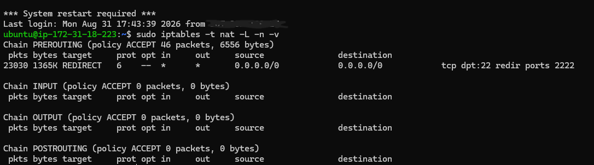
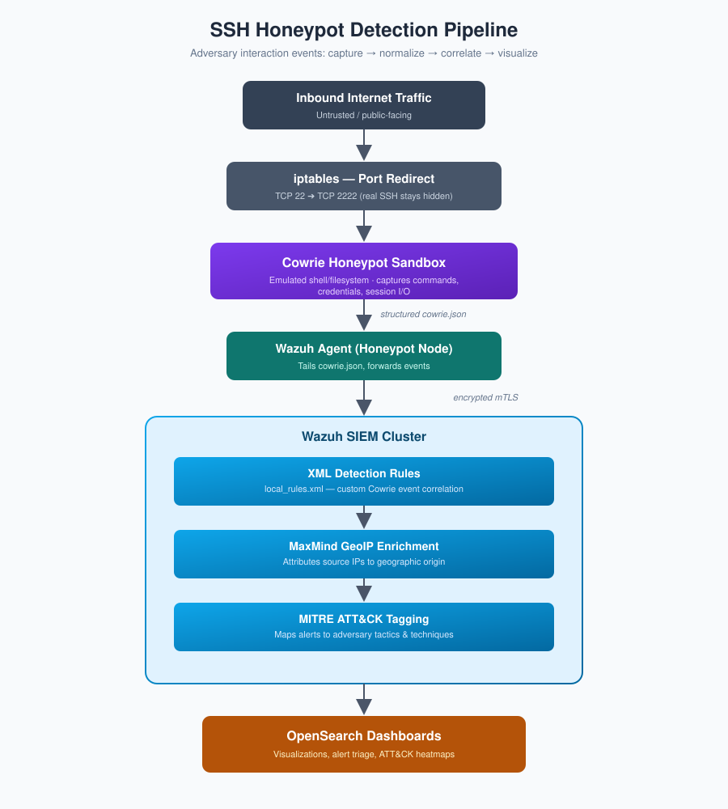
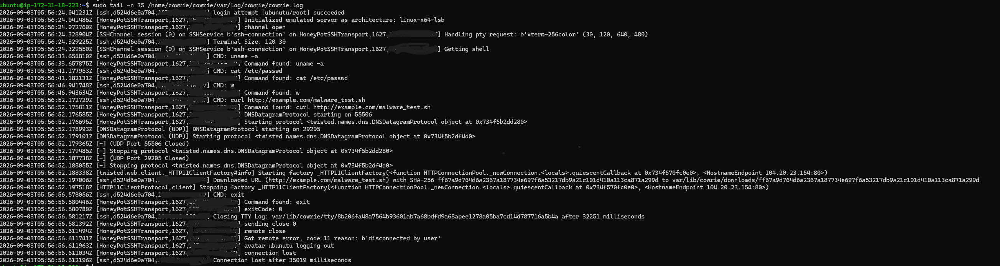
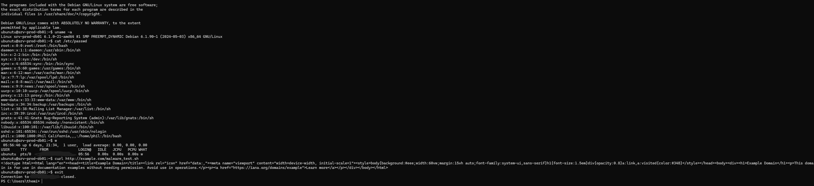

<div align="center">

# 🛡️ Cloud Threat Deception & SIEM Telemetry Pipeline
### **AWS EC2 • Cowrie SSH Honeypot • Wazuh SIEM/XDR • OpenSearch**

<br />


<br />
<br />

</div>

> **Executive Overview:** This project implements an enterprise threat deception environment hosted on AWS EC2. It safely lures, captures, and decodes live internet adversary operations using an isolated medium-interaction SSH/Telnet honeypot (Cowrie). Inbound telemetry is streamed via mutual TLS (mTLS) to a Wazuh SIEM cluster, normalized against custom XML detection rules, enriched with MaxMind GeoIP pipelines, and mapped to the **MITRE ATT&CK Framework** for threat characterization.

---

## 🚀 Key Architecture Highlights

* **Cloud Threat Deception:** Internet-exposed honeypot simulating a live Debian Linux system to record unauthorized authentications and adversary terminal commands safely in a sandbox.
* **Kernel Packet Redirection:** Network routing configured with Linux `iptables` NAT PREROUTING to forward traffic transparently from default SSH (TCP port 22) into sandbox port 2222.
* **Encrypted Telemetry Forwarding:** Structured JSON telemetry collected at the agent level and streamed over an mTLS channel to the central Wazuh Manager.
* **Custom Detection Logic:** XML detection decoders and rule logic (`local_rules.xml`) authored to categorize adversary actions and tag them to discrete MITRE ATT&CK techniques.
* **Threat Analytics & Visualization:** Aggregated dashboards visualizing geographical attack clusters, credential spraying wordlists, and automated post-exploitation command scripts.

---

## 🛡️ Step 1: Network Architecture & Host Hardening

To expose a realistic attack surface while keeping the underlying host completely protected:
1. **Administrative Isolation:** The true host `sshd` management daemon was rebound to a non-standard custom port and restricted exclusively to administrative IP addresses via AWS EC2 Security Groups.
2. **NAT Redirection:** Inbound public traffic on TCP port 22 is redirected directly to the unprivileged Cowrie daemon on port 2222 via kernel NAT tables.
3. **Sandbox Hardening:** Cowrie executes under an unprivileged `cowrie` service account with strictly limited filesystem rights.

<div align="center">
  
</div>

<p align="center">
  <em>Figure 1: Kernel PREROUTING redirection of TCP/22 to 2222.</em>
</p>

```bash
# Inbound traffic redirection to sandbox
sudo iptables -t nat -A PREROUTING -p tcp --dport 22 -j REDIRECT --to-port 2222
```

## 🔍 Step 2: Telemetry Ingestion Pipeline

<p align="center">
  
</p>

<p align="center">
  <em>Figure 2: End-to-end telemetry architecture from public packet redirection through sandbox ingestion, mTLS transport, SIEM enrichment, and OpenSearch visualization.</em>
</p>

### Agent Ingestion Target (`ossec.conf`)
The Wazuh Agent node monitors and streams structured events directly from Cowrie's active JSON sink:

```xml
<localfile>
  <log_format>json</log_format>
  <location>/home/cowrie/cowrie/var/log/cowrie/cowrie.json</location>
</localfile>
```

---

## 🔬 Step 3: Honeypot Telemetry & Adversary Session Capture

When adversaries connect to the honeypot, Cowrie serves an interactive Debian shell while recording credentials, HASSH client fingerprints, session runtimes, and keyboard inputs in real time.

<div align="center">
  
</div>

<p align="center">
  <em>Figure 3: Cowrie transport log capturing successful interactive shell access, pseudo-terminal (TTY) allocation, and automated post-exploitation command execution.</em>
</p>

<div align="center">
  
</div>

<p align="center">
  <em>Figure 4: Adversary terminal perspective showing emulated Debian environment and captured post-exploitation reconnaissance commands.</em>
</p>

---
---


## 🎯 Step 4: MITRE ATT&CK Mapping & Defensive Visibility

Inbound security events were aligned with the MITRE ATT&CK Enterprise Matrix within Wazuh to evaluate the progression of adversary tactics.

<div align="center">
  
</div>

<p align="center">
  <em>Figure 5: Wazuh MITRE ATT&CK framework view mapping active alerts against adversary tactics and techniques.</em>
</p>

<div align="center">
  
</div>

<p align="center">
  <em>Figure 6: Alert volume distribution categorized across Discovery, Defense Evasion, and Execution tactics.</em>
</p>

* **T1046 (Network Service Discovery):** Internet-wide port scanners sweeping public IPv4 ranges for active SSH daemons.
* **T1110 (Brute Force):** Automated credential-stuffing dictionaries targeting common default accounts (`root`, `admin`).
* **T1078 (Valid Accounts):** Infiltration events where attackers successfully authenticated into the honeypot sandbox.
* **T1059 (Command and Scripting Interpreter):** Post-exploitation reconnaissance executed through the emulated Unix shell (`uname`, `cat /etc/passwd`, `echo xsec`).


---

## 📊 Step 5: Threat Intelligence & Payload Analysis

### Attacker Command Breakdown
Automated scripts and interactive threat actors systematically executed profiling commands to probe architecture specs, test terminal output, and stage follow-on activities:

<div align="center">
  
</div>

<p align="center">
  <em>Figure 7: Aggregated post-exploitation command frequency distribution generated in OpenSearch Dashboards.</em>
</p>

| Observed Command Payload | Frequency | Defensive Analysis & TTP Objective |
| :--- | :--- | :--- |
| `uname -s -v -n -r -m` | **78.9% (243)** | Automated OS architecture, kernel build, and release identification. |
| `echo xsec` | **15.9% (49)** | Automated canary probe confirming interactive terminal execution before dropping payloads. |
| `exit` | **2.6% (8)** | Automated session teardown following completion or failed enumeration. |
| `uname -a` | **1.6% (5)** | Scripted system profile discovery. |
| `cat /etc/passwd` | **1.0% (3)** | Local user account enumeration and credential discovery. |

---

### Normalized SIEM Event Triage

Telemetry ingested by the Wazuh SIEM is parsed into queryable schema fields, allowing analysts to filter, sort, and correlate malicious sessions by source IP, target ports, and credential pairs.

<div align="center">
  
</div>

<p align="center">
  <em>Figure 8: Wazuh Discover console displaying parsed log telemetry fields (`data.src_ip`, `data.username`, `data.password`) alongside correlated MITRE ATT&CK technique IDs.</em>
</p>

* **Top Harvested Usernames:** `root`, `ubuntu`, `admin`, `guest`, `oracle`, `test2`, `hadoop`
* **Top Harvested Passwords:** `root`, `admin`, `123456`, `ubuntu`, `rootroot`, `oracle123`, `test2`

---

## ⚙️ Custom Detection Rules (`local_rules.xml`)

Custom XML rule definitions implemented on the Wazuh Manager decode the incoming Cowrie JSON events and trigger prioritized alerts mapped directly to MITRE ATT&CK techniques:

```xml
<group name="cowrie,honeypot,">
  <!-- SSH Brute Force Attempt -->
  <rule id="100100" level="5">
    <decoded_as>json</decoded_as>
    <field name="eventid">cowrie.login.failed</field>
    <description>Cowrie: SSH brute-force or failed login attempt</description>
    <mitre>
      <id>T1110</id>
    </mitre>
  </rule>

  <!-- Honeypot Interactive Infiltration -->
  <rule id="100101" level="8">
    <decoded_as>json</decoded_as>
    <field name="eventid">cowrie.login.success</field>
    <description>Cowrie: Attacker logged into honeypot interactive shell</description>
    <mitre>
      <id>T1078</id>
    </mitre>
  </rule>

  <!-- Post-Exploitation Command Activity -->
  <rule id="100102" level="10">
    <decoded_as>json</decoded_as>
    <field name="eventid">cowrie.command.input</field>
    <description>Cowrie: Post-exploitation command executed: $(input)</description>
    <mitre>
      <id>T1059</id>
    </mitre>
  </rule>
</group>
```